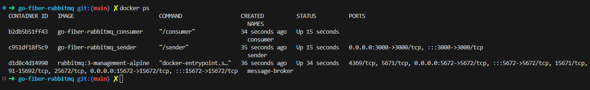

## QUICK START
1. Install Docker, Docker compose
2. Run containers

```bash
make run
```
or
```bash
docker-compose up -d
```



3. Http request, with tools(Postman, ...) or:

```console
curl \
    -- request GET \
    --url 'http://localhost:3000/send?msg=someinterestingwithgolang,fiber,rabbitmq'
```